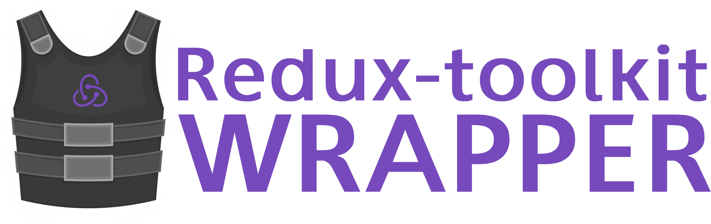

<div align="center">
    
</div>


# TheCodingMachine Redux-toolkit wrapper 

This project is a [Redux-toolkit](https://redux-toolkit.js.org/) wrapper used to write less code regarding classic CRUD operations.  
It's mainly used inside this RN Boilerplate : [`thecodingmachine/react-native-boilerplate`](https://github.com/thecodingmachine/react-native-boilerplate) 

## Installation

```
yarn add @thecodingmachine/redux-toolkit-wrapper
```

## Usage
```javascript
import {
  buildAsyncState,
  buildAsyncReducers,
  buildAsyncActions,
} from '@thecodingmachine/redux-toolkit-wrapper'
import fetchOneUserService from '@/Services/User/FetchOne'

export default {
  initialState: buildAsyncState('fetchOne'),
  action: buildAsyncActions('user/fetchOne', fetchOneUserService),
  reducers: buildAsyncReducers({
    errorKey: 'fetchOne.error', // Optionally, if you scoped variables, you can use a key with dot notation
    loadingKey: 'fetchOne.loading',
  }),
}
```

##API

### buildAsyncState
`buildAsyncState` create a loading and error state. You can scope it in a key.

|       Parameters      |      Description                            |   Type    |   Default  |
| :-------------------- | :------------------------------------------ | :-------- | :--------- |
| scope                 | name of the scope                           | string    | undefined  |

#### Example
```javascript
 buildAsyncState('fetchOne')
...
 buildAsyncState()
```

Will generate:
```
  {
    fetchOne: {
      loading: false, 
      error: null,
    }
  } 
...
  {
    loading: false, 
    error: null,
  } 
```

### buildAsyncActions
`buildAsyncActions` is a wrapper of [`createAsyncThunk`](https://redux-toolkit.js.org/api/createAsyncThunk).

|       Parameters      |      Description                            |   Type    |   Default  |
| :-------------------- | :------------------------------------------ | :-------- | :--------- |
| actionName            | the name of the action                      | string    | undefined  |
| action                | function to launch and await                | function  | () => {}   |

#### Example
```javascript
   buildAsyncActions('user/fetchOne', fetchOneUserService)
```

Where fetchOneUserService is an async function. 
So, when the fetchOneUserService is launched the action `user/fetchOne/pending` is dispatched.
When the fetchOneUserService is ended the action `user/fetchOne/fulfilled` is dispatched.
When the fetchOneUserService throw an error the action `user/fetchOne/rejected` is dispatched.

### buildAsyncReducers
`buildAsyncReducers` create default reducers based on CRUD logic. It creates three functions : pending, fulfilled and rejected.
- `pending` set the `loadingKey` to `true` and the `errorKey` to `null`.
- `fulfilled` replaces `itemKey` with the payload (if `itemKey` is not `null`) and the `loadingKey` to `false`
- `rejected` set the `loadingKey` to `false` and the `errorKey` to payload.


|   Parameters   |      Description               |   Type    |   Default |
| :------------- | :----------------------------- | :-------- | :-------- |
| itemKey        | the key of the item state      | string    | 'item'    |
| loadingKey     | the key of the loading state   | string    | 'loading' |
| errorKey       | the key of the error state     | string    | 'error'   |

#### Example
```javascript
buildAsyncReducers({
    errorKey: 'fetchOne.error', // Optionally, if you scoped variables, you can use a key with dot notation
    loadingKey: 'fetchOne.loading',
})
```

### buildSlice
`buildSlice` is a wrapper of [`createSlice`](https://redux-toolkit.js.org/api/createSlice).

|       Parameters      |      Description                              |   Type    |   Default        |
| :-------------------- | :-------------------------------------------- | :-------- | :--------------- |
| name                  | the name of the slice                         | string    | undefined        |
| modules               | array of all modules                          | array     | []               |
| sliceInitialState     | initial state for all modules of the slice    | object    | {}               |

#### Example
```javascript
buildSlice('user', [FetchOne], { item: {} } ).reducer
```

## License

This project is released under the [MIT License](LICENSE).

## About us

[TheCodingMachine](https://www.thecodingmachine.com/) is a web and mobile agency based in Paris and Lyon, France. We are [constantly looking for new developers and team leaders](https://www.thecodingmachine.com/nous-rejoindre/) and we love [working with freelancers](https://coders.thecodingmachine.com/). You'll find [an overview of all our open source projects on our website](https://thecodingmachine.io/open-source) and on [Github](https://github.com/thecodingmachine).
